# Data Model

Entity-relationship overview for the `calculatorapi` app. All models live in `calculatorapi/models/`, one file per entity.

For the complete diagram, paste [database-schema.dbml](database-schema.dbml) into
[dbdiagram.io](https://dbdiagram.io). The DBML snapshot includes all 35 application
models, 3 automatic join tables, and 7 framework tables, with all 345 columns and
47 foreign-key relationships as of 2026-09-13. It uses PostgreSQL types and documents
Django defaults, deletion behavior, and partial unique indexes in notes. Update the
snapshot when models change; the Mermaid diagram below is a selected overview.

---

## ERD

```mermaid
erDiagram
    CustomUser {
        int id PK
        string username
        string display_name
        string email
        int current_carat
        int current_paid_carat
        int uma_ticket
        int support_ticket
        bool daily_carat
        bool training_pass
        int sr_shards
        int sr_crystals
        int ssr_shards
        int ssr_crystals
        int club_rank_id FK
        int team_trials_rank_id FK
        int champions_meeting_rank_id FK
        int league_of_heroes_rank_id FK
    }

    ClubRank {
        int id PK
        string name
        int income_amount
    }

    TeamTrialsRank {
        int id PK
        string name
        int income_amount
    }

    ChampionsMeetingRank {
        int id PK
        string name
        int income_amount
    }

    LeagueOfHeroesRank {
        int id PK
        string name
        int income_amount
    }

    BannerTimeline {
        int id PK
        string name
        datetime jp_start_date "nullable"
        datetime jp_end_date "nullable"
        datetime global_start_date "nullable; set when confirmed"
        datetime global_end_date "nullable; set when confirmed"
        int schedule_offset_days "days to push this and every later date forward"
        string image
    }

    BannerUma {
        int id PK
        int banner_timeline_id FK
        string name
        int free_pulls
        bool is_recommended "editorial; presentation only"
        string admin_comments
    }

    BannerSupport {
        int id PK
        int banner_timeline_id FK
        string name
        int free_pulls
        bool is_recommended "editorial; presentation only"
        string admin_comments
    }

    Uma {
        int id PK
        string name
        int game_id "unique, nullable; the game's card id, e.g. 102001 = character 1020 outfit 01. The join key for imported game data; the image filename starts with it"
        string image
        string image_borderless "the same art without the rarity border; umas_borderless/ in the Space; nothing renders it yet"
        string admin_comments
        string purpose "PUBLIC, max 100, never null; the Timeline tile's hover overlay"
        bool is_time_limited
        string title "IMPORTED from here down (import_game_data overwrites): the outfit's [Title]"
        int rarity "initial stars 1..3; the selector ★ gate reads it via the is_three_star property, null = ★3"
        int running_style "1 front 2 pace 3 late 4 end"
        int apt_turf "ten apt_* grades on the game's 1..8 scale (G..S): turf dirt short mile medium long front pace late end"
        int base_speed "five base_* stats at the initial star count"
        int growth_speed "five growth_* bonuses in percent"
    }

    Skill {
        int id PK
        int game_id "unique; the game's skill id"
        string name "global English"
        string description "the game's text, shown by default"
        string description_detailed "fan translation with numbers; from gametora, optional"
        int rarity "1 white 2 gold 3/4 the two halves of a star-1/2 unique 5 unique 6 evolved (none yet)"
        int group_id "white, gold and x versions of one effect share it"
        int tier "-1 penalty 1 white 2 gold"
        int icon_id "one of 63 generic icons"
        int cost "skill points; null for uniques"
        string precondition "raw game string"
        string condition "raw game string, for a later parser"
        int evolves_from FK "self, nullable; empty until global has evolution"
        string image "skills/<icon_id>.png, set by link_skill_images"
        string admin_comments
    }

    UmaSkill {
        int id PK
        int uma FK
        int skill FK
        string source "unique | innate | awakening | evolved"
        int level "awakening rank 2..5, or the star a unique applies from; null for innate"
        string notes
    }

    SupportCardSkill {
        int id PK
        int support_card FK
        int skill FK
        string source "hint (game data) | event (gametora)"
        string notes
    }

    SupportCard {
        int id PK
        string name
        int game_id "unique, nullable; anchors image to the DO Space file. ALSO ENCODES RARITY: 1xxxx R, 2xxxx SR, 3xxxx SSR — banners may only link 3xxxx"
        string card_type "IMPORTED: speed stamina power guts wit friend group; blank until imported"
        int rarity "1 R 2 SR 3 SSR; IMPORTED, else the first digit of game_id on save"
        int character_id "IMPORTED: the game's character id, a number not a FK"
        string title "IMPORTED: the card's [Title]"
        string image
        string admin_comments
        string purpose "PUBLIC, max 100, never null; the Timeline tile's hover overlay"
    }

    UmasOnUmaBanner {
        int id PK
        int banner_uma_id FK
        int uma_id FK
        string recommendation
    }

    SupportsOnSupportBanner {
        int id PK
        int banner_support_id FK
        int support_card_id FK
        string recommendation
    }

    Plan {
        int id PK
        int user_id FK
        string name
        bool is_active "one per user"
        int income_profile_id FK "nullable: null = the account's stats"
        datetime created_at
        datetime updated_at
    }

    IncomeProfile {
        int id PK
        int user_id FK
        int current_carat "the same 22 stat columns as CustomUser"
        int club_rank_id FK
        datetime created_at
        datetime updated_at
    }

    UserPlannedBanner {
        int id PK
        int plan_id FK "the owner"
        int user_id FK "transitional, dropped in release 2"
        int banner_uma_id FK
        int banner_support_id FK
        int banner_step_up_id FK
        int number_of_pulls "steps on a step-up row"
    }

    BannerStepUp {
        int id PK
        int banner_timeline_id FK
        int anniversary_event_id FK
        string name
        string card_type "uma | support"
        int banner_count
        string image
        int order
    }

    GameEvent {
        int id PK
        string name
        string image
        int banner_timeline_id FK "nullable"
        int carat_amount
        int carats_throughout
        int support_ticket_amount
        int uma_ticket_amount
        int sr_shard_amount
        int sr_crystal_amount
        int ssr_shard_amount
        int ssr_crystal_amount
    }

    Scenario {
        int id PK
        string name
        string image "nullable; art often lands after the row"
        int banner_timeline_id FK "nullable; supplies the START only"
    }

    ChangelogEntry {
        int id PK
        string title
        string version
        date date
        string key "nullable unique; set = owned by changelog.yaml"
    }

    ChangelogChange {
        int id PK
        int entry_id FK
        string category
        string text
        int order
    }

    ChampionsMeeting {
        int id PK
        string name
        int cm_number
        datetime jp_start_date "nullable"
        datetime jp_end_date "nullable"
        datetime global_start_date "nullable; set when confirmed"
        datetime global_end_date "nullable; set when confirmed"
        int schedule_offset_days "days to push this and every later date forward"
        string image
        string track
        string surface_type
        string distance
        string length
        string track_condition
        string season
        string weather
        string direction
        int speed_recommendation
        int stamina_recommendation
        int power_recommendation
        int guts_recommendation
        int wit_recommendation
    }

    LeagueOfHeroes {
        int id PK
        int loh_number
        string name
        datetime jp_start_date "nullable"
        datetime jp_end_date "nullable"
        datetime global_start_date "nullable; set when confirmed"
        datetime global_end_date "nullable; set when confirmed"
        int schedule_offset_days "days to push this and every later date forward"
        string image
        string track
        string surface_type
        string distance
        string length
        string track_condition
        string season
        string weather
        string direction
        int speed_recommendation
        int stamina_recommendation
        int power_recommendation
        int guts_recommendation
        int wit_recommendation
    }

    UserOshi }o--|| CustomUser : "user"
    UserOshi }o--|| Uma : "uma"
    CustomUser }o--|| ClubRank : "club_rank"
    CustomUser }o--|| TeamTrialsRank : "team_trials_rank"
    CustomUser }o--|| ChampionsMeetingRank : "champions_meeting_rank"
    CustomUser }o--|| LeagueOfHeroesRank : "league_of_heroes_rank"

    BannerUma }o--|| BannerTimeline : "banner_timeline"
    BannerSupport }o--|| BannerTimeline : "banner_timeline"

    UmasOnUmaBanner }o--|| BannerUma : "banner_uma"
    UmasOnUmaBanner }o--|| Uma : "uma"

    SupportsOnSupportBanner }o--|| BannerSupport : "banner_support"
    SupportsOnSupportBanner }o--|| SupportCard : "support_card"

    Plan }o--|| CustomUser : "user"
    Plan }o--o| IncomeProfile : "income_profile"
    IncomeProfile }o--|| CustomUser : "user"
    UserPlannedBanner }o--|| Plan : "plan"
    UserPlannedBanner }o--|| CustomUser : "user (transitional)"
    UserPlannedBanner }o--o| BannerUma : "banner_uma"
    UserPlannedBanner }o--o| BannerSupport : "banner_support"
    UserPlannedBanner }o--o| BannerStepUp : "banner_step_up"
    BannerStepUp }o--|| BannerTimeline : "banner_timeline"
    BannerStepUp }o--|| AnniversaryEvent : "anniversary_event"

    GameEvent }o--o| BannerTimeline : "banner_timeline"
    Scenario }o--o| BannerTimeline : "banner_timeline"
    ChangelogChange }o--|| ChangelogEntry : "entry"

    AnniversaryEventBanner }o--|| AnniversaryEvent : "anniversary_event"
    AnniversaryEventBanner }o--|| BannerTimeline : "banner_timeline"
    AnniversaryEventProduct }o--|| AnniversaryEvent : "anniversary_event"
    UserPlannedPurchase }o--|| CustomUser : "user"
    UserPlannedPurchase }o--|| AnniversaryEventProduct : "product"
    UserPlannedPurchase }o--o| Uma : "target_uma"
    UserPlannedPurchase }o--o| SupportCard : "target_support"
```

---

## Key Constraints and Design Notes

### `CustomUser.display_name` — a preference beside the handle

The generated `user_xxxxxx` username is the row's identity (the admin, every
`__str__`) and nothing can change it. Since 2026-09-13 a preference sits
**beside** it, written only by `PATCH /account`: `display_name`,
`CharField(32, blank=True, default="")`. **Unique, ignoring case, among
non-blank names** (`unique_display_name_ci`: `Lower("display_name")` with a
partial condition, so the many blank rows do not collide). Decided 2026-09-13
because display names will be visible to other users through future features,
so nobody may take a name another account goes by; the serializer also refuses
a name equal to any account's *handle*, which would impersonate it. The
serializer's pre-check gives the friendly 400 ("That name is taken."), the
constraint is the backstop for a race, and the view maps that `IntegrityError`
to the same 400. Migration `0057` blanks later duplicates before adding the
constraint (insurance for local databases; prod never held a name before it).
Personal data (a chosen name is), so `purge_user_pii` blanks it and it is never
serialized anywhere public today.

→ [auth-and-privacy.md](auth-and-privacy.md) for why this is not a profile
attribute, and [api-reference.md](api-reference.md) for the route.

### `UserOshi` — the supporter-only picture

The umas a Patreon supporter picked as their "oshis", one row each:
`user` (FK, CASCADE, `related_name="oshis"`), `uma` (FK, **CASCADE**), `position`
(0-based). Unique on `(user, position)` and on `(user, uma)`. **The first one is
their picture** in the navbar and on the account page; free accounts have no
picture at all — the perk *is* the picture. `OSHI_SLOT_CAP = 5` is the table's
ceiling and equals the top rung of `benefits.OSHI_SLOT_LADDER` (asserted at
import).

- **Written only by `PATCH /account`**, which replaces the whole list and
  renumbers from 0 inside one transaction, so "the first" is always position 0
  among the rows that exist.
- **Entitlement is not stored here.** How many rows the current tier covers is
  `benefits.oshi_slots(user)` (5 / 3 / 1 / 0), derived per request like every
  other benefit — except staff, who get `OSHI_SLOT_CAP` regardless of tier
  (`oshi_slots_for(supporter, is_staff=...)`). That bypass reads `is_staff`,
  CustomUser's own field, so it adds no second copy of Patreon entitlement; it
  only unlocks the slot count, `supporter`/`is_supporter` in the `/account`
  response is untouched. **A lapse or downgrade keeps every row**: `GET /account` lists
  them all, shows the picture only while `oshi_slots >= 1`, and `PATCH` refuses
  only a list that *adds* past the count — a subset of what is already held may
  always be kept, reordered or trimmed.
- **CASCADE on the uma, not SET_NULL**: a slot with no uma is nothing, and the
  list will one day be shown publicly, where a dangling slot would be a blank
  tile. The remaining rows keep their positions; the view reads "first by
  position", so a gap is harmless.
- Only a uma **with an image** may be chosen (the serializer's queryset, and
  `GET /umas` offers nothing else). If an editor clears an image later the row
  stays, its `image` is `""` on the wire, and the picture falls through to the
  next oshi rather than to a broken tile.
- **Not personal data.** The site's own art; `purge_user_pii` leaves it. Decided
  2026-09-13 that oshis **will** appear publicly in a future feature, so the table
  is built to be joined from the supporter side; that route must go through
  `PatreonSupporter.linked_user`, honour `is_public`, and never carry the display
  name or handle.
- Admin: a read-only inline (removal allowed) on the user page. Not editable
  there because the entitlement check lives in the serializer.

### `CalculationConstants` — the projection's tunables

A singleton (always `pk=1`, `save()` pins it, `delete()` is refused) holding every
flat rate and schedule the carat projection uses. Read it with `.load()`, which
creates it with defaults on first access so a fresh database starts correctly
calibrated. Deliberately **not cached**: production runs several worker
processes, so an edit saved by one would not invalidate a local cache held by the
others and the site would serve two different sets of constants depending on
which worker answered.

It also owns `prediction_factor` and `game_event_end_buffer_days`, which used to
be module constants in `predictions.py` *and* duplicated in the frontend's
`gameConstants.ts` with a comment on each warning they be kept in sync by hand.
`predictions.py` keeps its DB-free purity: the pure functions take both as
parameters defaulting to the module constants, and only the ORM wrappers read the
model.

### The income ledger

`calculatorapi/ledger.py` assembles a flat, date-sorted row per reward instant
from `GameEvent`, `ChampionsMeeting` and `LeagueOfHeroes`, served as
`income_ledger`. It is built from the querysets and effective-date maps
`/calculator-data` already has in hand — no extra queries, no model of its own.

It computes **no income**: it places rows on a calendar and nothing more, which
is the one narrow exception to this project's "backend carries no projection
math" rule. Race rows carry no amounts (the payout depends on the user's rank,
which only the client knows), and no row is gated on "today" — the ledger is a
set of dated facts, past ones included, so that the client's single `today`
anchor governs every income source uniformly.

Placing a row is a judgement, though, and `RACE_REWARD_LEAD_TIME` is where that
shows. A Champions Meeting's finals settle and pay out **24 hours before** its
listed end, so its ledger row is dated `end_date - 24h` while its timeline card
still shows the real window. League of Heroes carries a lead time of zero and is
listed explicitly rather than omitted — CM and LoH are field-identical and
handled identically everywhere else, so the one divergence has to read as
deliberate. Because the ledger owns this, every consumer inherits it: the banner
rows, the income tiles, and the uncap-crystals panel (which reads race payout
instants from `income_ledger`, not from `champions_meeting_data`, for exactly
this reason).

### `Plan` — a named list of planned banners, and nothing else

An account holds up to `PLAN_CAP` (5) plans and the calculator opens on the active one.
`UserPlannedBanner.plan` is what a row belongs to; the row's owner is `plan.user`.

**A plan holds choices. The account holds facts.** That line decides what goes where:

| Data | Lives on | Why |
|---|---|---|
| Planned banner rows (`number_of_pulls`, `reserved_copies`) | `Plan` | the choices |
| Which of the owner's stats blocks to read (`income_profile`, nullable) | `Plan` | a pointer, not a fact; dropped when a copy changes owner |
| Carats, tickets, selector tickets, shards, crystals, ranks | `CustomUser`, or an `IncomeProfile` the account owns | facts about the person (or about their other game account) |
| The income toggles | same row as the balances | income side |
| `UserPlannedPurchase` | the account | money the person spends; it feeds income |
| `UserStepUpSelection` | the account | already keyed to the banner, and changes no number |

So the same plan projected for two people gives two different answers, which is the point.
Worked example: Alice (80,000 carats, top ranks) and Bob (12,000 carats, middling ranks)
both hold a plan that says "Kitasan, 200 pulls". Alice sees it comfortably funded. Bob sees
a shortfall. Nothing on the plan differs; everything that differs is on their accounts.

That portability is deliberate. A later feature lets a player publish a plan and another
player take it, and both are `plans.copy_plan()` plus a visibility rule. A plan that never
held anything about its author needs no stripping when it is copied and cannot leak what
someone holds or spends. **Do not add a field to `Plan` that describes the person.**
`reserved_copies` passes that test: only the count is stored, and which ticket or crystal
pays for each copy is derived on render from the viewer's own balances.

Accepted consequence: purchases are shared across plans. A pack planned to fund a step-up
in one plan still credits its carats while another plan is open.

Both account-side collections could move onto the plan later without losing data (add the
FK, copy the one set into each plan). The reverse would have to merge several sets into
one. Account-side is therefore the choice that stays cheap to change.

**The one exception is a pointer: `Plan.income_profile`.** A person who plays several game
accounts wants a plan projected against the other account's numbers. Those numbers live on
an `IncomeProfile` row the same person owns (next section), and the plan holds only a
nullable FK to it. `plans.stats_target(plan)` returns the profile or the owner's own row,
and is the only place that decides; every read and every save of `user_stats_data` goes
through it. `plans.copy_plan()` keeps the pointer within one account (a Duplicate of "my
alt's plan" should read the alt's numbers) and drops it whenever the copy changes owner, so
the portability argument above still holds.

**`is_active`, not a `CustomUser.active_plan` FK.** That FK would be circular and could be
pointed at somebody else's plan. A boolean on the person's own row cannot. The partial
unique constraint `one_active_plan_per_user` forbids two; zero is repaired by
`plans.get_active_plan()`, which promotes the oldest.

**Every account always has a plan**, without a signal or a change to sign-up:
`plans.get_active_plan(user)` creates "Main plan" the first time anything asks. Migration
`0067` gave one to every user who already had planned rows and skipped everyone else on
purpose, so there is one way a first plan comes to exist rather than two.

**Every plan id is resolved through `plans.get_owned_plan(user, plan_id)`.** That function
is the ownership check. Somebody else's plan and a missing one are the same `DoesNotExist`.

**The cap is checked on creation only.** It never rejects a save to an existing plan and
never deletes one, so lowering it later strands nobody's data.

**Analytics count the ACTIVE plan only.** Spare plans are what-ifs; summing them would
report demand from rows nobody intends. The admin's "Planned by" column counts distinct
users for the same reason.

#### Two releases: `UserPlannedBanner.user` is transitional

`git push origin master` runs `migrate` while the old code is still serving, so the column
the old code writes cannot be dropped in the deploy that stops writing it.

| Release | Schema | Code |
|---|---|---|
| 1 (`0066`, `0067`) | `Plan` added; `UserPlannedBanner.plan` NULLABLE; backfill | writes `user` AND `plan`, reads by `plan` |
| 2 (not yet written) | sweep plan-less rows, `plan` NOT NULL, drop `user` | drop the dual write |

During release 1's deploy window the old code can still save a row with a `user` and no
`plan`. `plans._adopt_planless_rows()` moves such rows into the owner's active plan on
their next request, so nothing disappears from anyone's calculator. It is one `UPDATE` that
almost always matches nothing, and it goes away with release 2. Every spot that exists only
for this window is marked `TRANSITIONAL` in the code.

### `IncomeProfile` — a second stats block, for a plan that reads its own numbers

The 22 stat columns (four rank FKs, eight income toggles, ten balances) are defined once,
on the abstract `GameStats` model in `models/game_stats.py`, and inherited by both
`CustomUser` (the account's own numbers, as always) and `IncomeProfile` (the numbers of
another game account the same person plays). Moving the fields off `CustomUser` into the
base changed no column; `makemigrations --check` must stay quiet for `CustomUser` after any
edit to the base, and if it does not, the base drifted and the fix is the base, never a
migration on the user table. The serializers mirror it: `GameStatsSerializer` holds the
field list and `UserStatsSerializer` / `IncomeProfileSerializer` set only the model, so a
plan switch hands the client either block in the same shape and it never learns which.

A profile has `user` (CASCADE, `related_name="income_profiles"`), the stats and
timestamps. No name (decided 2026-09-21): a profile is reached only through the plans that
point at it, so a name would have nowhere to appear yet. `user` is kept even though every
pointing plan already knows its owner: it is the ownership check, the cascade on account
delete, and the admin's list column. Nothing here is personal data; `purge_user_pii`
leaves it alone.

**Lifecycle, all in `plans.py`:**

| Operation | What happens |
|---|---|
| `attach_income_profile(plan)` | creates a profile seeded from whatever the plan reads today (`stats_target`), points the plan at it. No-op if it already has one. `GameStats.field_names()` drives the copy, so a new stat column is copied without anyone remembering. |
| `detach_income_profile(plan)` | points the plan back at the account; deletes the profile if no other plan still uses it. |
| `delete_plan(plan)` | after the delete, the same unused-profile check. |
| `copy_plan(source, owner=...)` | same owner: keeps the pointer (this is how two plans come to share a profile in v1, there is no picker). Different owner: `None`. |

`Plan.income_profile` is `SET_NULL`, not `CASCADE`: deleting a profile in the admin sends
its plans back to the account's stats and never takes a banner row. The API exposes the
profile only as `separate_income: true | false` on `PATCH /plans/<id>` and a read-only
`income_profile_id` on `Plan`; a body can never name a profile by id, because attaching an
existing profile is a later feature that needs its own ownership check.

Purchases and step-up picks stay on the account (decided 2026-09-21): an alt's plan sees
the main account's planned packs, the same accepted consequence as above. If a player with
an alt asks, purchases follow with a nullable `income_profile` FK on `UserPlannedPurchase`.

### `UserPlannedBanner` — exactly-one check constraint

A DB-level `CheckConstraint` named `exactly_one_banner_target` enforces that every row has
exactly one of `banner_uma`, `banner_support` or `banner_step_up` set and the other two
null. The serializer also validates this at the application layer before the row reaches
the database.

It replaced the two-way `only_one_support_or_uma` in migration `0039` when step-ups were
added. A three-way `Q(...) | Q(...) | Q(...)` rather than a count, because the constraint
has to be expressible in SQL and enumerating the legal combinations is what Django's
`CheckConstraint` can compile.

This is the discriminated union that the frontend mirrors — narrowed with
`plannedBannerTarget()`, never by checking which FK happens to be set.

### `BannerStepUp` — a campaign's Select Step-Up ladder

A Select Step-Up is not a banner you pull on; it is a five-step cost ladder bought with
paid carats, where the fifth step of each round hands over a card the player chooses from
the back catalogue. One row per **pool** per campaign, not one per banner: `card_type`
says which pool (`uma` = star-3, `support` = SSR) and `banner_count` says how many such
banners the campaign runs. The 5th Anniversary is therefore two rows, not five.

`max_steps` is a property, `banner_count * 5` — served rather than left to the client so
the count and the rule that turns it into steps stay together.

**Two FKs, and they must agree.** `banner_timeline` says when the ladder is buyable;
`anniversary_event` says which campaign it belongs to (and therefore which
`jp_cutoff_date` bounds its candidates). `clean()` validates that the timeline is one of
the campaign's own Parts, because nothing in the schema prevents wiring a step-up to a
window its campaign never runs in. Both use `related_name="step_up_banners"` — different
models, so no clash, and each side reads naturally.

The cutoff is **folded onto the serialized step-up** as `jp_cutoff_date`, the same way
`AnniversaryEventProductSerializer` folds it onto a selector product. The client reads it
from there rather than joining the campaign: one place resolves the cutoff, and it is the
server.

### `UserStepUpSelection` — the ten cards a user would pick

One row per filled slot, keyed to **`BannerStepUp`** rather than to `UserPlannedBanner`.
"Which ten cards would I pick here" is a fact about the banner, not about a plan row: it
changes no cost, no odds and no eligibility. So it needs no plan to exist, and survives
one being deleted.

That keying is also what keeps it a **flat sibling collection** in the PATCH body.
Hanging it off `UserPlannedBanner` would have forced a writable nested serializer,
because a newly staged planner row has no id until the same request creates it — the
client could not have referenced it.

Three constraints:

| Constraint | What it says |
|---|---|
| `exactly_one_selection_card` | one of `uma` / `support`. **Exactly** one, unlike `UserPlannedPurchase.at_most_one_selector_target` — an empty slot is an absent row, so a row with no card means nothing |
| `unique_step_up_selection_slot` | one card per `(user, banner_step_up, slot)` |
| `one_step_up_target_per_banner` | partial unique index on `is_target=True` — at most one step 5 pick per banner |

The card FKs **CASCADE**, not `SET_NULL`. A nulled FK would leave a row the first
constraint forbids, and nothing is lost: the UI renders slots 1–10 and derives the empty
ones from *missing* rows, so a cascaded delete and a nulled FK look identical on screen.

**Eligibility is validated but grandfathered.** A card released on JP after the
campaign's `jp_cutoff_date` is rejected — *unless* the user already had that
`(step-up, card)` pair stored. Cutoffs are reference data editors keep correcting, and
re-checking untouched picks lets one narrowed cutoff `400` an entire PATCH, taking the
user's stats and banners with it. `UserPlannedPurchaseSerializer` learned this the hard
way and solves it with `_pairing_is_unchanged`; that keys off `self.instance`, which
cannot work here because selections are replaced wholesale with **id-less** rows, so
every row is a create. `_stored_selection_pairs` snapshots the prior set before the
reconcile instead.

Nothing in the projection reads any of this — see
`frontend/docs/resource-projection-logic.md`.

### `AnniversaryEvent` owns the link to `BannerTimeline`, not the other way round

A campaign spans several banner "Parts" (the 3rd Anniversary is four separate
`BannerTimeline` rows), recorded by the `AnniversaryEventBanner` through table with a
`part_number`. The link deliberately lives on the campaign side: `BannerTimeline` is
shared, heavily-used content and gains no campaign column, exactly as `GameEvent`
already owns its own FK to it.

**The campaign owns no dates.** `start_date` / `end_date` are resolved by spanning the
linked parts — earliest resolved start, latest resolved end — via
`predictions.anniversary_event_effective_dates`. That keeps campaigns on the one shared
prediction calendar, inheriting `is_predicted` and the cascading schedule offsets for
free. A standalone set of jp/global date fields would need its own prediction anchor,
and with only ~3 campaigns holding confirmed global dates that anchor would be far
weaker than `BannerTimeline`'s. `is_predicted` is true if **any** contributing part is
predicted: a range is only as certain as its least certain edge.

**`main_start_date` is a third date: when the event itself begins.** An anniversary opens
with a **Part 1 run-up** — "the anniversary is coming, here are some login rewards" — and
the anniversary proper starts at **Part 2**, on JP 02-24 or 08-24, the game's own launch
date. `start_date` answers "when does the campaign open"; `main_start_date` answers "when
is the anniversary", and they sit about ten days apart. `predictions._main_part` picks it:

- **Anniversaries** take the lowest `part_number` **≥ 2**. Selected on part number, never
  on date order — the 5th Anniversary's Part 4 opens *before* its Part 3 (concurrent
  banners, as the sheet records them), so "the second part by date" is not Part 2.
- **Falling back to the opening part** covers two real shapes. The 0.5th Anniversary has
  no Part 2 in the timeline data at all (that banner has no `BannerTimeline` row, so only
  its Part 3 link resolves), and a campaign an editor has linked only a Part 1 to has no
  later part to point at.
- **`new_year` and `campaign` keep the opening part.** Only anniversaries run a run-up. A
  New Year campaign's Part 1 *is* the New Year banner (New Years 2025 = Katsuragi Ace +
  Mr. C.B.), and the `campaign` catch-all is a single-part promotion. For both,
  `main_start_date == start_date`.

It is never null when `start_date` isn't, and always inside `[start_date, end_date]`.
`applied_offset_days` tracks the **main** part, because that is the instant the projection
credits a purchase at. Consumers that *place* a campaign on a calendar (the planner's
section bands, the Timeline's campaign card) or credit a purchase read `main_start_date`;
consumers describing the campaign's window read `start_date` / `end_date`.

### `AnniversaryEventProduct` — one tagged model for packs and selectors

Carat packs and selector tickets are the same shape: a priced item attached to a
campaign, bought in some quantity, crediting paid carats. The only difference is that a
selector additionally grants a ticket, which `product_type` records
(`carat_pack` / `uma_selector` / `support_selector`). Two near-identical tables would
have duplicated every field and forced every reader to union them; this repo already
narrows on tag fields elsewhere (see `event_type` on the timeline union).

Real-money prices live in the database, never in code, so they can be corrected without
a deploy when the store changes.

### Selector eligibility: a derived gate and a stored one

Two independent gates decide whether a selector may take a card. The **temporal** one is
derived; the **intrinsic** one is stored. Both must pass — `eligibility.py`'s
`selection_refusal_reason()` is the single entry point that checks both, and callers use
it rather than `is_eligible()` alone.

#### The intrinsic gate is stored, on `Uma`

`Uma.is_time_limited` (default `False`) and `Uma.rarity` mark units a selector can
**never** take at any cutoff. Neither is derivable: a time-limited or ★1/★2 unit sits on
ordinary banners and is indistinguishable from a selectable one from the banner data
alone. Both sit in the admin under "Selector availability".

The ★ half is read through the `Uma.is_three_star` **property**: `rarity` is 3, **or
null**. Null counts as ★3 so an uma nobody has game data for (anything not on global yet)
stays selectable. `import_game_data` writes `rarity` for every uma in the global snapshot
and overwrites a hand edit there; for an uma that is not on global, an editor sets it by
hand and the import leaves it alone until the uma releases. There was a stored "Is ★3"
checkbox until migration 0065, which carried each hand-unticked row with no rarity
forward as ★2, since the box never said which of ★1/★2 it was.

This gate is **independent of the cutoff and bites even when the cutoff is `null`**, which
the temporal gate waves through. That is why neither serializer backstop may early-return
on a null cutoff — the old `if cutoff is None: return` admitted exactly these units.

`SupportCard` has no equivalent: ★3 is an uma-side concept (supports are SSR/SR), so a
support card is only ever gated on its date. Both predicates read the flags defensively
(absent ⇒ unrestricted), so a support card passes the intrinsic gate unconditionally.

Like the cutoff, both flags are **grandfathered against a user's stored picks**. An editor
flagging a unit must not `400` the plan of everyone who already picked it — that rejection
takes their stats and banners down with it. The existing grandfathering in
`UserPlannedPurchaseSerializer._pairing_is_unchanged` and
`UserStepUpSelectionSerializer`'s `stored_pairs` runs *before* either gate, so it covers
both for free.

#### The temporal gate is derived

A selector may only take cards released on JP on or before its cutoff (inclusive). There
is no stored "JP release date": it is derived as `MIN(BannerTimeline.jp_start_date)` over
the banners a card has appeared on (`calculatorapi/eligibility.py`). Validated against
the source sheet's own cutoffs — `30184 Sakura Bakushin O` derives 2024-01-31, exactly
the 3rd Anniversary cutoff it is listed as selectable under; `30287 Neo Universe` derives
2026-01-30, exactly the 5th's. Deriving keeps this correct for free as banner data grows;
a stored column would drift.

Note the constraint is usually **binding**, and that is correct: a campaign's cutoff
falls before its own banners, so a selector granted at an anniversary essentially never
covers that anniversary's featured unit.

### Rank tables — static reference data

`ClubRank`, `TeamTrialsRank`, `ChampionsMeetingRank`, and `LeagueOfHeroesRank` are static reference tables seeded from fixtures. They are never written to by user-facing endpoints. `CustomUser` holds a nullable FK to the user's current tier in each.

`LeagueOfHeroesRank` data is returned by the API and used by the resource projection — each `LeagueOfHeroes` event whose `end_date` falls within a banner window contributes the user's rank `income_amount` to the carat total.

### `ChampionsMeeting` and `LeagueOfHeroes` are the same shape

The two hold identical data — course details (`track` … `direction`) and five stat
recommendations — differing only in their number field (`cm_number` / `loh_number`) and in
`ChampionsMeeting` owning the `ChampionsMeetingUmaRecommendation` join table. They render
through one shared frontend card (`components/timeline/RaceEventCard.tsx`), so a field
added to one almost always belongs on the other; the same goes for their serializers and
`ModelAdmin` fieldsets.

They are deliberately **two concrete models, not one table with a type column**: they
predict their global dates against *separate* anchor sets (see below), and merging them
would mix those anchors. The fields are duplicated rather than pulled into an abstract base
— a conscious trade of a little repetition for keeping each model readable on its own.

The course/stat columns are non-null, so "not announced yet" is encoded as a **sentinel**:
`"TBD"` for text and `0` for the recommendations. Both models default to those, and the
frontend translates them into a pending state rather than rendering them raw.

### Through tables carry recommendation text

`UmasOnUmaBanner` and `SupportsOnSupportBanner` are explicit through models (not Django's auto-generated M2M table) because they carry a `recommendation` field — freeform admin notes about whether a card/uma on a banner is worth pulling. This text is exposed by the `BannerTimelineForViewingSerializer` used in `banner_timeline_data`.

### Three editorial notes on a card, and which of them is public

They are easy to confuse, and every one of them reaches the public payload:

| Field | Lives on | Scope | Rendered? |
|---|---|---|---|
| `recommendation` | the two through tables | one card **on one banner** | yes — a badge on the Timeline tile |
| `purpose` | `Uma`, `SupportCard` | the card itself, on every banner | yes — the tile's hover / focus / tap overlay |
| `admin_comments` | cards and banners | notes for editors | **no** — but `/calculator-data` still serializes it |

`purpose` is a `CharField(max_length=100, blank=True, default="")`: capped so the overlay
always fits the narrowest tile, and never null, so "no purpose" has one representation. The
admin gives it its own **Shown to players** fieldset so it can't be mistaken for
`admin_comments` — which nothing renders, but which is public all the same.

### `is_recommended` — per banner, presentation only

`BannerUma.is_recommended` / `BannerSupport.is_recommended` is the editorial "Recommended"
flag: the Timeline panel's SSR treatment and the planner dropdown's gold star. It sits on the
banner, not on `BannerTimeline`, because the uma and support banners in one window are pulled
on independently — and because a `BannerStepUp` points at its campaign's timeline too, so a
window-level flag would recommend all three. No projection reads it (the same contract as
`banner_category`).

The admin toggles it with `list_editable`, deliberately not a bulk action: bulk actions are
`queryset.update()`, which fires no `post_save`, so `public_payload_cache` would keep serving
the old flag until its TTL expired.

### `GameEvent` reward amounts are fields, not a separate model

Reward amounts used to live on a separate `EventReward` model, one-to-many with `GameEvent`. In practice every event had at most one immediate reward and one throughout-the-event reward, so the two were folded directly onto `GameEvent` as fields instead: `carat_amount` (+ the ticket/shard/crystal fields) is earned once the event's own resolved `start_date` passes, and `carats_throughout` is prorated by elapsed time across `start_date`..`end_date` (computed client-side — see `remainingThroughoutForRow` in `frontend/src/utils/incomeLedger.ts`), independent of `start_date`. Only carats are ever distributed this way; tickets/shards/crystals are always a lump on `start_date`.

### `BannerTimeline.banner_category` — presentation only, and it mirrors the sheet

A `TextChoices` field recording what *kind* of banner window a row is. Nothing in the projection math reads it; it exists to drive the timeline card's layout and the category filter, and to give sheet-parity audits a diffable key.

It maps 1:1 onto the "Banner Type" column (`BC`) of the source sheet's Timeline tab:

| Sheet code | `banner_category` | Rows in sheet | Shape |
|---|---|---|---|
| `1` | `standard` | 105 | 1–2 umas + 1–2 supports |
| `2` | `race_prep_support` | 29 | 1 uma + **10** supports |
| `-2` | `golden_week_revival` | 4 | 3–11 umas, **zero** supports |
| `0` | `rerun` | 2 | 1 uma |
| `-1` | *(no member)* | 46 | Champions Meeting / League of Heroes |

**Sheet code `-1` deliberately has no member.** Those rows are `ChampionsMeeting` and `LeagueOfHeroes`, which are their own models and never become `BannerTimeline` rows. A parity harness that doesn't know this will report 46 phantom missing banners.

Two rules that keep the field from rotting:

- **Category drives the chrome; count drives the grid.** Accent, label and column arrangement key off `banner_category`, but how many tiles fit per row stays derived from the actual `umas` / `support_cards` length. A miscategorised row then still renders every card it has instead of clipping them.
- **It is `banner_category`, not `banner_type`.** "Banner type" already means Uma-vs-Support across the frontend (`initialBannerType`, `bannerKey(bannerType, id)`, the `banner-type-tab--uma` class). These are different axes and must not share a name.

`golden_week_revival` is the only category derivable from the data — more than 2 umas *and* zero supports. That emptiness is structural: the sheet's `-2` block overwrites its support columns with umas, and the supports for that window live on a separate, concurrently-running standard banner. `manage.py classify_banner_categories --dry-run` applies exactly that rule, and `rerun` is reported for confirmation rather than auto-applied.

`race_prep_support` is **not** derived at all. Those 29 rows shipped with their uma side only and no support cards, which makes them indistinguishable from an ordinary one-uma banner, so `manage.py backfill_race_prep_supports` reads the category straight from the master CSV's `Banner Type` column and writes it in the same transaction as the 290 support-card links. Note that backfill moves ~24 support cards' derived `first_jp_date` earlier, which widens selector eligibility — see the command's docstring.

### `BannerTimeline` has two serializers

`BannerTimelineSerializer` — the flat version, embedded inside `BannerUma` and `BannerSupport` objects.

`BannerTimelineForViewingSerializer` — the expanded version returned under `banner_timeline_data`, which nests the full `banner_umas` and `banner_supports` lists including the per-card/uma recommendation text from the through tables.

Both serializers share an `EffectiveDateMixin` that emits **resolved** `start_date`/`end_date` (plus an `is_predicted` flag) under the original field names.

### JP-based dates with predicted global dates

The site targets the **global** server, but global dates are only confirmed ~1 month out. `BannerTimeline`, `ChampionsMeeting`, and `LeagueOfHeroes` all store JP dates (`jp_start_date`/`jp_end_date`, always known) and confirmed global dates (`global_start_date`/`global_end_date`, null until confirmed). For unconfirmed rows the global dates are **predicted** from the JP schedule. The three serializers share `EffectiveDateMixin`, and each content type is resolved into its **own** effective-date map (its own anchor set) — rows are never mixed across models.

Prediction (fixed anchor, in `calculatorapi/predictions.py`):
- **Anchor** = the row with the greatest `jp_start_date` among those having BOTH a confirmed `global_start_date` and a `jp_start_date`.
- `predicted_global_start = anchor.global_start_date + (target.jp_start_date − anchor.jp_start_date) × 0.664`
- `predicted_global_end = predicted_global_start + (target.jp_end_date − target.jp_start_date)`

The calculator view builds one effective-date map per content type (keyed by row id) once per request and injects each via serializer context, so the resolved dates are consistent across every serialization path. **Prediction requires the anchor to have a `jp_start_date`** — historical rows migrate with JP dates null, so the most-recent confirmed rows must have their JP dates backfilled in the admin for prediction to activate.

### Schedule offsets: correcting a prediction that has drifted

The 0.664 factor assumes global keeps a steady pace. When it doesn't — a delayed banner, an inserted break week — *every* prediction after the slip is wrong by the same number of days. `schedule_offset_days` (an `IntegerField(default=0)` on all three models) is the manual correction, applied by `apply_schedule_offsets()` as a **second layer on top of** the anchor math, which it leaves untouched.

- The offset pushes **its own row and every dated row after it** forward by that many days. Both ends move, so the run length is preserved.
- Offsets **stack**: a row's applied offset is the sum of `schedule_offset_days` from every offset-carrying row whose base start date is at or before its own.
- The cascade **spans all three content types at once** — one shared calendar. This is the one place rows *are* mixed across models; anchors remain strictly per-model. `build_effective_date_maps()` is the composed entry point (per-model base maps, then one shared offset pass) and is what `/calculator-data` calls; don't call `build_effective_date_map()` per model there or offsets will be resolved against an incomplete calendar.
- **Only predicted rows take part, as source or target.** A confirmed date is a fact and is never shifted — and because a confirmed row stops *contributing* too, an offset goes inert by itself once its row is confirmed. That second half matters: the newly confirmed row becomes the anchor, so its real date already carries the slip, and a still-live offset would count the same delay twice. Nothing has to be cleaned up by hand.
- **An offset at or before the target's own anchor is skipped.** Same reasoning, one step further out. A prediction is measured forward from its model's anchor, whose global date already embodies every slip up to itself; re-applying those slips double-counts them. `compute_effective_dates()` stamps `anchor_start` on every entry so the (model-blind) offset pass can tell where each row was measured from. The rule above can't cover this on its own — it only sees a slip and the row that absorbed it being *the same row*, never a different model's anchor sitting after the offset.
- Negative values are allowed (pulling the schedule earlier). Unlike positive offsets, a negative one can reorder rows relative to each other.

> **Why the anchor rule exists — the League of Heroes case (fixed 2026-08-13).** Global has never run a League of Heroes event, so `LeagueOfHeroes` has no genuinely confirmed row; the one global date it carries was entered by hand, copied off the already-slip-corrected calendar. That row became the anchor. Every other LoH row inherited the accumulated offset *through* the anchor and then had it applied a second time, putting all 14 predicted events **6–7 days late** against the source spreadsheet while banners and Champions Meetings tracked it to within a day. The trap is generic: it fires whenever a model's anchor is a hand-filled far-future date rather than a near-term confirmation, which is unavoidable for content global hasn't reached yet.

Worked example — a confirmed banner on Aug 10, then predicted rows on Aug 24 (offset **+7**), Sep 2 (a Champions Meeting), Sep 7, Sep 12 (a League of Heroes event, offset **+3**) and Sep 21:

| Row | Offsets at or before it | Applied | Final start |
|---|---|---|---|
| Banner, Aug 10 (confirmed) | — (skipped) | 0 | Aug 10 |
| Banner, Aug 24 | its own +7 | +7 | Aug 31 |
| Champions Meeting, Sep 2 | the banner's +7 | +7 | Sep 9 |
| Banner, Sep 7 | the banner's +7 | +7 | Sep 14 |
| League of Heroes, Sep 12 | +7, plus its own +3 | +10 | Sep 22 |
| Banner, Sep 21 | +7 and +3 | +10 | Oct 1 |

Serializers expose both `schedule_offset_days` (the row's own value) and `applied_offset_days` (the cumulative total already baked into `start_date`/`end_date`). The latter is diagnostic only — the dates are complete without it — but a cascading rule is hard to debug from outside without it.

**Known limitation:** the self-healing is per-model. When a banner confirms, its offset also stops reaching later Champions Meeting / League of Heroes rows, whose own anchors have not moved, so those can snap back. Set an offset on the CM/LoH row itself if that matters in practice.

### `GameEvent` dates are derived from its linked `BannerTimeline`, not owned

Unlike `BannerTimeline`/`ChampionsMeeting`/`LeagueOfHeroes`, `GameEvent` has no `jp_*`/`global_*` columns of its own — it never runs its own anchor/prediction math. Instead it holds a nullable `banner_timeline` FK, and its `start_date`/`end_date`/`is_predicted` are resolved by looking that FK up in the *existing* `BannerTimeline` effective-date map (`game_event_effective_dates()` in `calculatorapi/predictions.py`, mirroring the same cross-model-lookup pattern `planned_effective_start()` uses for `UserPlannedBanner`): `start_date` is the linked banner's own resolved start, `end_date` is the banner's resolved end **plus 4 days**, and `is_predicted` propagates from the banner's entry.

Because those dates are read *after* the offset pass has run, a `GameEvent` inherits its banner's schedule offset for free — it has no `schedule_offset_days` of its own, only the resulting `applied_offset_days`.

`banner_timeline` is nullable (`on_delete=SET_NULL`) because not every event corresponds to a single banner — some tie to Champions Meeting rewards instead, some are campaign-wide events spanning multiple banners at once, and some are future placeholders — and because an event's own content (image, reward amounts) stays meaningful even if the banner it was tied to is later deleted. An unlinked (or unresolvable) event simply resolves to `null` dates, same as any other "no anchor" case in this system.

The standalone `/events` route serves **confirmed-only** dates (`game_event_confirmed_dates()`, no prediction), matching the same convention used by `/leagueofheroes` — prediction is reserved for `/calculator-data`, which builds the richer map (`build_game_event_date_map()`) and reuses the request's single `BannerTimeline` emap rather than computing a second one.

### `Scenario` borrows a start and never has an end — the fourth date shape

A **training scenario** is a new, optional way to play the game (URA Finals, Aoharu, Grand Live, Hashire! Mecha Umamusume). It grants nothing: it exists to mark *when the game changed* on the timeline and in the calculator's section bands.

There are now four ways a model gets dates from `BannerTimeline`, and it is worth reading them together:

| # | Shape | Who | Dates |
|---|---|---|---|
| 1 | Content on a banner | `BannerUma`, `BannerSupport`, `BannerStepUp` | none of its own |
| 2 | Borrow the banner's window | `GameEvent` | start = banner start; end = banner end **+ 4 days** |
| 3 | Span several "Parts" | `AnniversaryEvent` | earliest part start → latest part end |
| 4 | **Borrow the banner's START only** | **`Scenario`** | **start = banner start; no end, ever** |

**Shape 4 is the only one with no end at all, and that is a fact about scenarios rather than a gap in the data.** A scenario is released and then stays available permanently — a newer scenario does *not* retire an older one, it just tends to get played more because it is more rewarding. There is therefore nothing for an end date to mean, and deriving one from the launch banner would invent an expiry the scenario has never had. `scenario_effective_dates()` returns `end_date: None` unconditionally, and `StartInstantDateMixin` drops the field from the wire entirely rather than emitting a permanent `null`.

Otherwise it follows `GameEvent`'s precedent exactly: a nullable `banner_timeline` FK (`on_delete=SET_NULL`, because a scenario's name and image stay real content if its launch banner is later deleted), resolved against the *existing* `BannerTimeline` effective-date map, with `is_predicted` and `applied_offset_days` propagating from the banner — so a scenario inherits its banner's schedule offset for free.

`scenario_effective_dates()` is deliberately its **own** function rather than a generalisation shared with `anniversary_event_effective_dates()`. `predictions.py`'s convention is one function per derivation shape: the mechanisms are shared (`_ResolvedDateMixin`, `effective_sort_key`), the policies are not. An anniversary's range is a *sales window* whose start is the instant purchases are credited; a scenario's start is just when a new way to play appeared. Merging them would put a scenario-only concern inside anniversary date maths the first time the two diverge.

`image` is nullable by workflow, not by accident: scenarios get entered while a feature is being built and the art arrives later. Every consumer must render without it.

### The changelog is authored in the repo, and synced on deploy

`ChangelogEntry` is the one content model with a second authoring route.
`calculatorapi/data/changelog.yaml` holds patch notes as text, and
`manage.py sync_changelog` writes them into the table. Production runs that
command in the service's `run_command`, right after `migrate` — a deploy is the
only route to the production database, since the app's database is an App
Platform *dev* database with no external endpoint.

The reason is that the changelog is the one piece of site content that describes
the **code**: an entry is written in the same pull request as the work it
announces, reviewed with it, and ships when it ships. Nothing else here has that
property, which is why nothing else gets this treatment.

`key` is what divides the two routes:

| `key` | Written by | On a deploy |
|---|---|---|
| set | `changelog.yaml` | title, version, date and **every** change line are replaced from the file |
| NULL | a person, in the admin | untouched |

Three consequences worth knowing:

- **`key` is NULL, not `""`, for a hand-written entry.** It is `unique`, and a
  unique column permits any number of NULLs but only one empty string — so a
  blank default would make the *second* admin-written entry an `IntegrityError`.
  `ChangelogEntry.save()` normalises falsy to `None` so every write path agrees.
- **Change lines are replaced wholesale**, not reconciled row by row. The file is
  the authority on the whole list, and delete-then-create is immune to the
  ordering collisions a per-row update hits when a line moves position — the same
  reasoning as `user_step_up_selection_data`'s id-less PATCH.
- **Removing an entry from the file does not delete it.** It only stops being
  managed. A deploy silently deleting published content is a worse failure than a
  stale line, so that direction is deliberately not automated.

`sync_changelog` **exits 0 on a file it cannot parse** and writes nothing, because
it runs on the path that starts the web service: a typo in a patch note must not
be able to keep the API from booting. `--strict` inverts that for local checks,
and `ShippedChangelogFileTests` validates the committed file so a broken one
never reaches a deploy in the first place.

### `SitePage`, `FaqCategory`, `FaqItem` — the prose the team edits

The About page, the carat income guide and the FAQ. They used to ship in the
frontend bundle; since 2026-09-15 they are rows the admin edits and
`GET /site-content` serves (→ `api-reference.md`). Terms and the Privacy Policy
are **not** here and should not be moved here: they make claims the code has to
keep true, so they change with the code.

`SitePage.slug` is a `choices` field (`about`, `carat-income-guide`), and
`SitePageAdmin` refuses add and delete. A page only exists because the frontend
has a route for it, and a route is code; adding a page is a new choice, a seed
file and a frontend route, never an admin action. `FaqCategory` and `FaqItem` are
fully editable: an item's `slug` is its deep-link anchor on the FAQ page and is
`unique` across the whole FAQ, so a link never needs to know the category.
`FaqItem.show_on_homepage` is what the homepage teaser reads; the frontend shows
however many are ticked, in FAQ order.

Why typed models and not a generic key/value table: the same reasoning as
`CalculationConstants`. Real forms, ordering fields, the homepage flag, and no
stringly-typed lookups on the client. Why markdown and not HTML: the site
already rendered markdown, it is plain text in the database, and react-markdown
does not render raw HTML by default, so a row can never put script on the site.

**The seed runs once.** Migration `0058_site_content` creates the tables and
then `get_or_create`s the rows from `calculatorapi/data/site_content/`
(`about.md`, `carat-income-guide.md`, `faq.yaml`) through
`calculatorapi/site_content_seed.py`. From then on the database owns the text;
editing a seed file changes what the *next* fresh database starts from and
nothing already deployed. That is the opposite of the changelog's arrangement
below, on purpose: patch notes describe the code, these pages do not.

All three are in `public_payload_cache._IRRELEVANT_MODELS`, since they have
their own endpoint and are absent from `/calculator-data`.

### `Feedback` — visitor-submitted, deliberately unattributable

One message from the public feedback form (`POST /feedback`). Unusual among the
models here in that its rows come from *visitors* rather than from an editor or
from a signed-in user's plan, which drives three decisions worth stating.

**No IP address column, ever.** The privacy policy's promise that a visitor's IP
is never stored is site-wide, not scoped to the traffic beacon. The instinct when
building an abusable public endpoint is to log the submitter's address for
forensics; doing that here would quietly make a published promise false. Abuse is
handled by rate limiting instead (`feedback` throttle scope, 10/hour), which
reads the address to build a cache key but never persists it.

**No contact details.** The form has no reply-address field, so feedback is
one-way by design and the "we do not collect or store your email address"
sentence in the policy stays true as written. A sender who types an address into
the message body has it stored as ordinary text — which is why the form carries a
"please don't include personal details" hint and the policy gained a "Feedback
you send us" section.

**`user` is `on_delete=SET_NULL`, not `CASCADE`.** This is load-bearing rather
than stylistic. `purge_user_pii` is IRREVERSIBLE and is meant to be run against
production; under `CASCADE`, stripping PII from accounts would also destroy every
bug report those accounts had ever filed. `SET_NULL` keeps the report and drops
only the linkage. The column has to be nullable regardless, because guests — the
majority of senders, since the whole site works signed out — submit with no user
at all.

The admin (`FeedbackAdmin`) is read-mostly to match: every content field is
`readonly`, `has_add_permission` is `False`, and `is_resolved` is the only
editable field. A row is a record of what somebody said; the workflow is triage,
not authoring, and making that structural keeps "accidentally reword a user's
report" out of reach.

---

### `Skill` is imported, and "versions" are a group, not a table

Every `Skill` row comes from `manage.py import_game_data` reading the committed snapshot,
which creates missing skills and overwrites the game-owned columns on every run. The two
editor-owned columns are `image` and `admin_comments`. `image` is set in bulk by
`manage.py link_skill_images` from `icon_id` (63 generic icons cover 718 skills, hosted on
the Space under `skills/<icon_id>.png` by `scripts/fetch_skill_icons.py --upload`); a
hand-picked image survives re-runs because the linker only fills empty ones.

"Is this the gold version of something" is answered by `group_id` and `tier`, which the
game itself uses: the white (○), gold (◎) and penalty (×) versions of one effect share a
`group_id`, and `tier` says which this row is. The admin's read-only "Versions" column lists
the siblings. `evolves_from` is the other relationship, for evolved skills, and stays empty
until global has skill evolution (the model and the extractor are ready; the import will
need the `skill_upgrade_*` tables then).

`UmaSkill` records which outfit carries which skill and how (`source`), unique on
`(uma, skill, source)`. `level` is one nullable column with a per-source meaning: the
awakening rank for `awakening` rows, the star count a unique applies from for `unique` rows
(so a ★1/★2 outfit has two `unique` rows, at 1 and at 3), null for `innate`. The import adds
rows and updates a level but never deletes, so a row an editor adds by hand survives.
Edited as an inline on the uma's admin page.

`SupportCardSkill` does the same for support cards, unique on `(support_card, skill,
source)`: `hint` rows come from the game's own hint table in the snapshot, `event` rows from
gametora's per-card pages (`scripts/fetch_support_events.py` writes
`support_events.json` next to the snapshot; the game has no clean table for them). A hint
listed under two hint groups is one row. Edited as an inline on the support card's page.

`description` is the game's own text and is what a page should show by default;
`description_detailed` is gametora's fan translation with the concrete numbers, imported
only when `--gametora skills.json` is passed, for a future "detailed" toggle. It has never
been imported, and stays that way until the user confirms gametora's text may be used.

**"On global" is derived, never stored.** A skill is on global when the game gives it an
English description: `Skill.objects.on_global()` / `.not_on_global()` and the
`Skill.is_on_global` property (`SkillQuerySet` in `models/skill.py`), with a read-only
admin column and an "On global" filter. A skill that is not there yet may sit in the
backend, but anything that shows skills to a player (the CM planner, a skill page) must go
through `on_global()`. Every skill in the global client has a description today, so the
filter's "Not yet" side is empty; the rule exists so it holds when that changes.

## The game's master database (`master.mdb`) and the committed snapshot

The skills work imports from the global game client's own database rather than a fan
site. The Steam client keeps it as a plain SQLite file that it re-downloads on every
update (`.../AppData/LocalLow/Cygames/Umamusume/master/master.mdb`, about 16 MB, English
text, global content only). `scripts/extract_master_snapshot.py` reads it and writes the
slice this project needs to `scripts/data/master_snapshot/*.json`, which **is committed**;
the mdb never is. `manage.py import_game_data` reads the JSON, so an import is reviewable
as a diff and reproducible on a machine without the game. `meta.json` records the mdb's
size and modification time and every file's row count.

The tables the extractor reads, and the two places the schema is not what it looks like:

| Need | Table | Notes |
|---|---|---|
| skills | `skill_data` (718 rows) | `rarity` 1 white, 2 gold, 3/4 the pre- and post-★3 uniques of a ★1/★2 character, 5 unique. No 6 (evolved) on global yet. `group_id` groups white with gold; `group_rate` is the tier (1 white, 2 gold, -1 the × penalty version). `icon_id` is one of 63. `condition_1` is the activation condition, kept verbatim |
| skill text | `text_data` cat 47 (name), 48 (description) | keyed by skill id; every skill has both |
| skill point cost | `single_mode_skill_need_point` | absent for every unique and 18 white/gold skills, so nullable |
| uma outfits | `card_data` (105, of which 2 are tutorial variants above id 9,000,000, skipped) | `default_rarity` is the initial star count; `running_style` 1 front, 2 pace, 3 late, 4 end; `talent_*` are the growth bonuses in percent |
| per-star stats and aptitudes | `card_rarity_data` (334) | one row per outfit per star. `speed`..`wiz` are the base stats at that star; `max_*` is the cap (1200 everywhere); `proper_*` aptitudes on the game's 1..8 scale (G F E D C B A S). **`skill_set` is not a skill id**: it keys the `skill_set` table, whose `skill_id1` is the unique skill that star carries |
| innate and awakening skills | `available_skill_set` (721) | keyed by `card_data.available_skill_set_id`; `need_rank` 0 innate, 2..5 the awakening level |
| outfit text | `text_data` cat 4 (full), 5 (title), 6 (character name by character id) | |
| support cards | `support_card_data` | `rarity` 1 R, 2 SR, 3 SSR; `command_id` is the training command, named by `text_data` category 55 and read from there by the extractor (101 speed, 102 **power**, 103 **guts**, 105 **stamina**, 106 wit: not stat order), and 0 with `support_card_type` 2 friend / 3 group |
| support card hints | `single_mode_hint_gain` (2063) | **keyed per card by `support_card_id`**, not by the card's `skill_set_id` (several cards of one character share that as `hint_id`, with different rows each). `hint_gain_type` 0 rows are skills (`hint_value_1`); type 1 are stat hints, skipped. 15 cards have none: friend, group and Haru Urara cards |
| support card text | `text_data` cat 75 (full), 76 (title), 77 (character) | |

What the ids encode, which the import asserts on: an outfit id `100101` is character
`1001`, outfit `01`, so the character is `id // 100`; a support id's leading digit is its
rarity; a unique skill id embeds the character (`100011` is Special Week's base outfit,
`110011` her second, `120011` her third), and a ★1/★2 character carries a rarity-3 unique
(`10271`) until ★3, when the rarity-4 one (`100271`) replaces it. `card_skills.json`
therefore lists two `unique` rows for those 17 outfits, with `level` the star at which
each first applies.

Support card **event** skills are not in any clean table (they come from story choice
data); gametora's per-card pages are the agreed source for that one piece, fetched by
`scripts/fetch_support_events.py` into `support_events.json` in the same folder (their
Next.js data endpoint, slug `<id>-<gametora name>`; 648 rows across 249 cards on
2026-09-16). Ids only: no gametora name or description is stored.

`scripts/check_against_gametora.py` is the other use of gametora, and it stores nothing:
`--numbers` compares every snapshot card's rarity, stats, growth, aptitudes and support
type with their pages, and `--stale` lists cards whose global release date has passed but
which the snapshot lacks (so: launch the game, re-extract). Its first run, 2026-09-17,
found the extractor's hand-typed `command_id` table had stamina, power and guts rotated;
the extractor now reads the command names from the game (`text_data` category 55).

## `PatreonTier` / `PatreonSupporter`

The public thank-you list on the home page (`GET /supporters`), authored in the
admin. Two models: `PatreonTier` is the pledge ladder (`name` + a hand-set
`order`), `PatreonSupporter` is one person on it.

**This is the only table holding data about people who never signed up to this
site**, which is what shapes every decision in it.

**It holds a display name, an email, a tier, a pledge start date and Patreon's
opaque user id, and nothing else — keep it that way.** Patreon's members export
is a wide PII file: email, Discord handle, postal address, phone, charge
history, lifetime totals. None of that is needed to say thank you or to run the
admin.

Both import paths exclude the rest by construction rather than by filtering
afterwards:

- `admin_patreon_import.py` names the four CSV columns it reads (`Name`, `Email`,
  `Tier`, `Patron Status`) and drops the rest of the row before returning — there
  is no passthrough dict, so adding a field is a visible change rather than a
  silent one. `Email` is read but **not required**: an export predating the column
  still imports, leaving the field empty.
- `patreon_api.py` names the fields it requests (`MEMBER_FIELDS`), so the excluded
  data is never sent at all. Note this is the *only* thing excluding it: a creator
  access token automatically holds every v2 scope, so the token is capable of
  reading patron addresses and phone numbers and simply never asks. There are no
  scopes to leave unticked.

### `patreon_user_id` and `linked_user` — the join to a website account

The daily sync always knew **who is pledging**; `SocialAccount` always knew **who
is signed in**. Nothing joined the two, so no site feature could depend on a
pledge. These two fields are that join, and they are the whole of Phase 2.

`patreon_user_id` is Patreon's opaque id for the *person* — the same value
`SocialAccount.subject_id` stores when they sign in with Patreon. Storing it is a
deliberate exception to the paragraph above, on four grounds:

- It is **opaque**: it identifies nobody without Patreon's own database, exactly
  like the subject ids already held for every account.
- It arrives as a **relationship** (`include=user` → `relationships.user.data.id`)
  whose sideloaded resource is held empty by `fields[user]`. That fieldset names
  one throwaway boolean (`hide_pledges`) rather than nothing: an **empty**
  `fields[user]=` is an HTTP 400 from Patreon, and an absent one brings back the
  full default profile. `MEMBER_FIELDS` — the privacy boundary — did not change
  to get this id, and a test asserts that.
- The alternative was matching patrons to accounts **by email**, which would mean
  collecting an email from every site user. This id exists precisely to avoid that.
- It is **never serialized**, the same treatment as `email`.

`linked_user` is `OneToOneField(..., on_delete=SET_NULL)`. Deleting a site account
must not delete a supporter row — they are still a patron, they just have no
account here any more — and the same holds when they unlink by hand or
`purge_user_pii` runs. In every one of those cases the row survives with its
`is_public` consent and `patron_since` intact. Identical treatment to a lapse.

**Entitlement is derived from these, never stored as a flag.**
`is_supporter = linked_user is set AND is_active AND tier is not None`, computed
per request in `calculatorapi/benefits.py`. A cached boolean would be a second
truth that drifts the moment a pledge lapses or resumes — invisibly, in the
direction nobody reports.

**CSV and hand-entered rows never get an id** and therefore can never be linked
to an account. That is a real limitation and the strongest reason to prefer the
API sync over the CSV upload.

**Backfill needs no data migration.** The first API sync after deploy matches
existing rows by name and writes the id in (`ids_filled` in the summary); from
then on that patron is matched the reliable way.

### `email` — admin-only, and why it is the exception

Patreon display names are not stable and not distinctive: a patron who renames
themselves imports as a *second* row beside the one they already had, and two
people can pick names differing only in punctuation. The email is the one value
in the export that is stable and unique per person, so it is what lets an editor
tell those rows apart.

Three things keep it contained, and all three are load-bearing:

1. **It is not on the wire.** `PatreonSupporterSerializer` lists its fields
   explicitly and `email` is not among them. `GET /supporters` is public and
   unauthenticated, so serializing it would publish every consenting supporter's
   address to anyone loading the home page. `test_email_never_reaches_the_public_endpoint`
   asserts this on its own rather than leaving it to the field-set check.
2. **It is shown in the admin and nowhere else** — `list_display`, `search_fields`
   and the first fieldset of `PatreonSupporterAdmin`. The import summaries name
   *who* had an email updated, never the address itself.
3. **It is overwritten, but never cleared.** Unlike `patron_since`, a non-empty
   incoming value wins (a patron who changes their Patreon address should show
   the new one, and there is no editorial judgement to preserve). An **empty**
   incoming value means "don't know" — a CSV with no `Email` column, or a member
   Patreon holds no address for — so the stored value survives.

`purge_user_pii` still does not touch this table on an ordinary run: supporters
are not accounts, and wiping the field the admin identifies them by should not be
a side effect of the legacy account purge. Pass **`--include-patreon`** to blank
supporter emails deliberately — for a takedown request, or when decommissioning
the Patreon integration. It blanks the email only; rows, tiers and publication
decisions survive.

**`is_public` defaults to `False` and no import ever touches it.** Patreon's
`full_name` is frequently a real billing name rather than a chosen handle, so
"is a patron" cannot mean "is publishable" — and Patreon has no field recording
consent to be named on someone else's website, so the decision is not derivable
from their data at all. A supporter is counted in `anonymous_count` until an
editor ticks the box on their row; a sync can add, deactivate and re-tier people,
but it can neither publish a name nor un-publish one. **This is the rule that
makes the unattended daily sync safe** — without it, an automated job would put a
stranger's legal name on the home page at 06:17 UTC with nobody watching.

**`patron_since` is filled, never overwritten.** Only the API supplies it; a date
an editor corrected by hand survives every later sync.

**Lapsed supporters are deactivated, not deleted** (`is_active`), so a returning
patron keeps their `patron_since` and — more importantly — the consent decision
already made about them, instead of silently reverting to the default.

**Two uniqueness constraints, and which one applies depends on where the row
came from.** `unique_patreon_supporter_patreon_user_id` covers rows that HAVE an
id; `unique_patreon_supporter_display_name` (over `Lower("display_name")`) covers
only rows that do **not**, and that partial condition is load-bearing.

Two patrons are free to choose the same display name. While this table only fed a
thank-you list, collapsing them was harmless. Once entitlement hangs off the row
it costs one of them the thing they paid for — and nothing reports it, because a
dropped row looks exactly like a lapsed one, after which `deactivate_missing`
retires whichever row already existed. So API rows are keyed on the id and are not
name-constrained at all, while CSV and hand-entered rows keep the collision
protection they still need.

The reconcile matches the same way: **id first, display name as the fallback**. A
name match against a row with no id yet *adopts* it. The one case it refuses to
guess at is an id-less row whose name matches two stored rows — nothing is written
and the import summary reports it (`ambiguous`) for an editor to sort out.

**`tier` is `on_delete=SET_NULL`.** Deleting a tier must not delete the people on
it; they fall back to the unstyled base rendering until re-tiered.

`PatreonTier` deliberately carries **no money column**. The pledge amount is
Patreon's to change and would only go stale here, and the CSV's `Lifetime Amount`
is a running total that would reorder the list every month as long-standing
entry-tier patrons overtake newer higher-tier ones. `order` is set by hand.

---

## `PatreonCredentials`

The OAuth token pair for the API sync, in one row (singleton, `pk=1`, read with
`load()` — the same pattern as `CalculationConstants`).

**Tokens live here rather than in the environment because they are mutable
state, not configuration.** A Patreon access token expires roughly monthly, and
refreshing one **rotates the refresh token too** — the one just used is spent. So
the pair has to be written somewhere the running process can write to, and App
Platform env vars are read-only at runtime. The client id and secret stay in the
environment, where they belong: they never rotate on their own, and keeping them
out of the database means a database dump does not carry the half that mints
tokens.

**`load()` seeds from `PATREON_ACCESS_TOKEN` / `PATREON_REFRESH_TOKEN` only when
the row is empty.** That is what lets production bootstrap itself on the first
sync — the production database has no external endpoint, so the only other route
is the POST_DEPLOY job recipe in `.do/app.yaml`. Once a pair is stored, the
environment is ignored: after the first refresh those values are stale, and
honouring them would resurrect a spent token.

**Deliberately not registered in the admin.** A live API token has no business
being rendered into a web page, and nothing here is editable by hand. It is
therefore also absent from `UNFOLD["SIDEBAR"]["navigation"]` and from
`create_content_editor_group`'s `CONTENT_MODELS` — an editor can run a sync
without being able to read the credentials it uses.

`last_sync_error` holds our own diagnostic string, never a Patreon response body,
so an upstream error cannot smuggle member data into this row.
